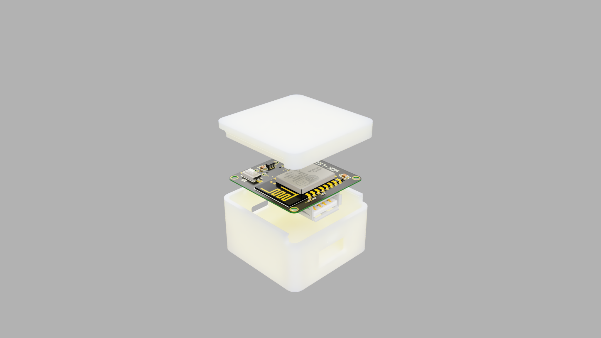

# WDK-LED
一款基于苹果生态的智能可调台灯设计，主控采用ESP-12F。能够直接接入IOS系统的“家庭”APP

> 一款mini智能台灯主控
>
> * 内置WEB配网，上电先连接上次的WIFI
> * 直连Homekit，无需桥接
> * 良好的人机交互模式
> * 超mini的尺寸
> * ............

目前市面上支持HomeKit的设备比较少，有的话也比较贵，但使用IOS设备的人不在少数。所以设计了这么一款产品，使用教程等可以查看产品的官网[http://wdkiot.7yunkj.com](http://wdkiot.7yunkj.com/)

